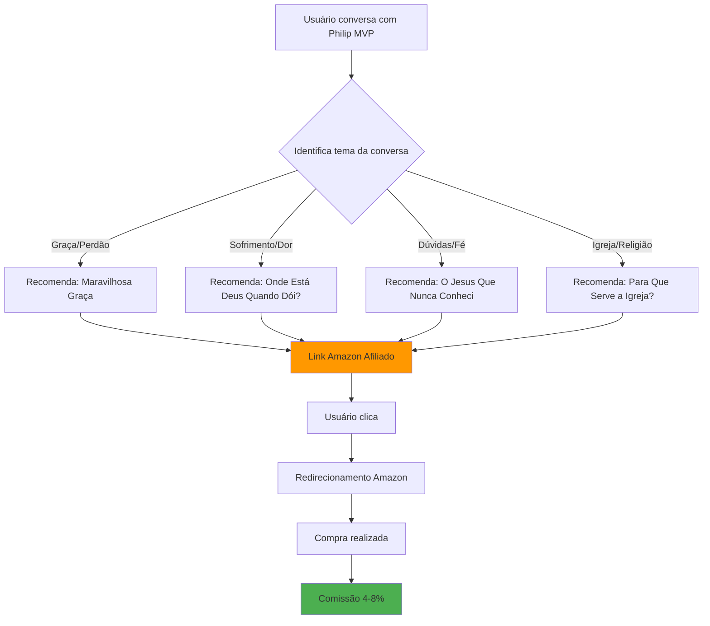
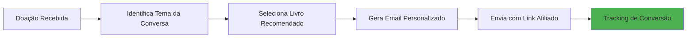
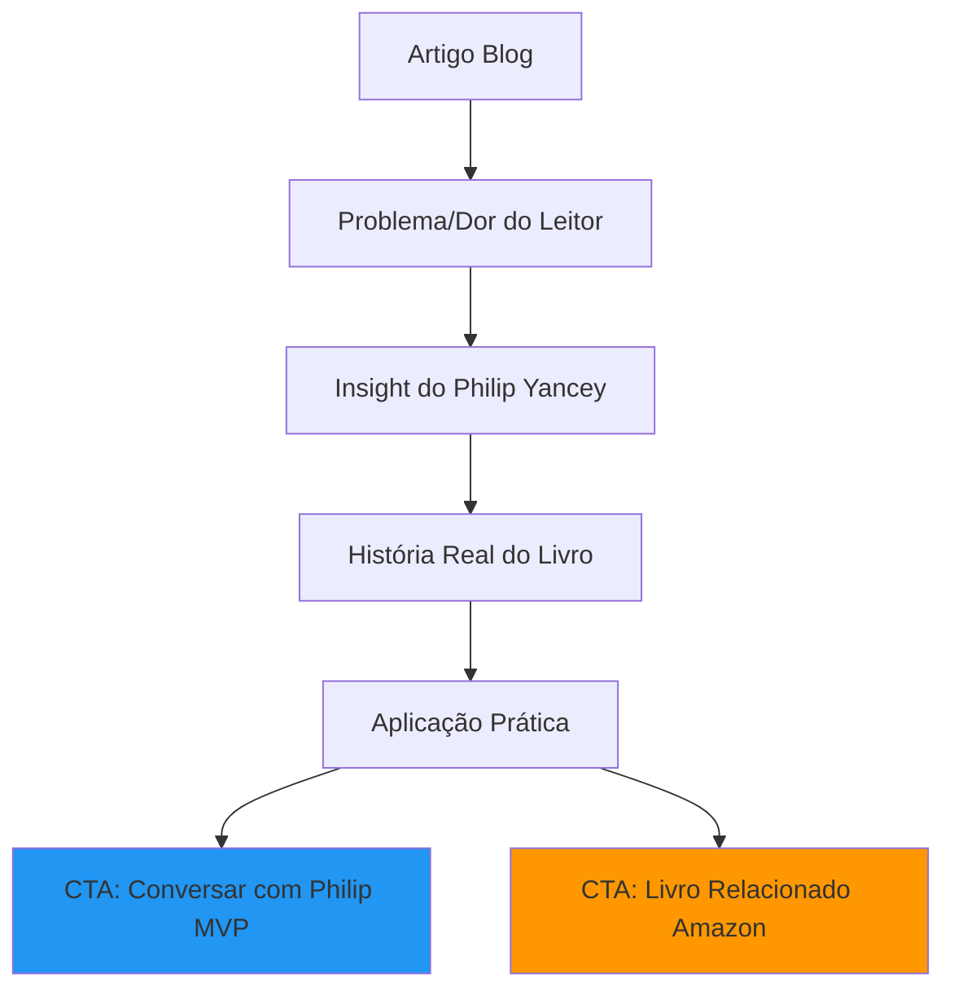

# 📚 ESTRATÉGIA AMAZON AFILIADOS - IMPLEMENTAÇÃO

## 🎯 INTEGRAÇÃO AMAZON ASSOCIATES

### **Fluxo de Recomendação Inteligente**


---

## 💰 CÁLCULO DE RECEITA AMAZON

### **Livros Philip Yancey no Brasil**
| Livro | Preço Médio | Comissão (6%) | Vendas/Mês | Receita/Mês |
|-------|-------------|---------------|-------------|--------------|
| Maravilhosa Graça | R$ 45 | R$ 2,70 | 50 | R$ 135 |
| Onde Está Deus Quando Dói? | R$ 38 | R$ 2,28 | 30 | R$ 68 |
| O Jesus Que Nunca Conheci | R$ 42 | R$ 2,52 | 40 | R$ 101 |
| Para Que Serve a Igreja? | R$ 35 | R$ 2,10 | 25 | R$ 53 |
| **TOTAL** | | | **145** | **R$ 357** |

### **Potencial de Escala (6 meses)**
- 500 usuários ativos/mês no MVP
- 30% taxa de conversão para livros
- 150 vendas/mês = **R$ 375-750/mês**

---

## 🛠️ IMPLEMENTAÇÃO TÉCNICA

### **Setup Amazon Associates**
```javascript
// Configuração dos links de afiliado
const AMAZON_AFFILIATE = {
  associateId: "philipyanc-20", // Seu ID depois do cadastro
  baseUrl: "https://amazon.com.br/dp/",
  
  books: {
    "marvilhosa_graca": {
      asin: "8573258692",
      title: "Maravilhosa Graça",
      price: "R$ 45,90",
      keywords: ["graça", "perdão", "julgamento", "ungrace"]
    },
    "onde_esta_deus": {
      asin: "8573254568", 
      title: "Onde Está Deus Quando Dói?",
      price: "R$ 38,50",
      keywords: ["sofrimento", "dor", "silêncio", "Job"]
    }
  }
}

// Sistema de recomendação inteligente
const recommendBook = (conversationContext) => {
  const keywords = extractKeywords(conversationContext);
  const matchedBook = findBestMatch(keywords, AMAZON_AFFILIATE.books);
  return generateAffiliateLink(matchedBook);
}
```

### **Integração no MVP**
```javascript
// Componente de Recomendação
const BookRecommendation = ({ conversationContext }) => {
  const recommendedBook = recommendBook(conversationContext);
  
  return (
    <div className="book-recommendation">
      <h3>📚 Livro Relacionado</h3>
      <p>Baseado na nossa conversa, você pode se interessar por:</p>
      
      <div className="book-card">
        
        <div>
          <h4>{recommendedBook.title}</h4>
          <p>{recommendedBook.description}</p>
          <a 
            href={recommendedBook.affiliateLink}
            target="_blank"
            className="buy-button"
          >
            Ver na Amazon - {recommendedBook.price}
          </a>
        </div>
      </div>
    </div>
  );
};
```

---

## 📧 EMAIL MARKETING MELHORADO

### **Template de Follow-up Contextual**
```
Assunto: Obrigado por sua doação, [Nome] - Uma leitura especial para você

Olá [Nome],

Que alegria ter você em nossa comunidade! Sua doação de R$ [Valor] vai ajudar a levar esperança e cura espiritual para muitas pessoas.

Baseado em nossa conversa sobre [Tema da Conversa], pensei que você se identificaria profundamente com o livro "[Livro Recomendado]" do Philip Yancey.

🎁 Como um pequeno agradecimento, aqui está um desconto especial:
[Link Afiliado Amazon com UTM]

Algumas citações marcantes deste livro:
"[Citação relevante ao tema da conversa]"

Se quiser continuar nossa conversa sobre [Tema], estou sempre aqui:
[Link para o MVP]

Com gratidão,
Philip Yancey (via IA)

---
P.S.: Se preferir, também temos uma versão digital disponível [Link]
```

### **Automação N8N Melhorada**


---

## 📝 BLOG/CONTEÚDO ESTRATÉGICO

### **Temas para SEO + Afiliados**
| Artigo | SEO Keywords | Livro Relacionado | CTA |
|--------|--------------|-------------------|-----|
| "Como Superar Trauma Religioso" | trauma religioso, igreja tóxica | Maravilhosa Graça | Link afiliado |
| "Por Que Deus Permite Sofrimento?" | sofrimento, Deus, dor | Onde Está Deus? | Conversa MVP |
| "Perdão: O Que A Bíblia Realmente Diz" | perdão, Bíblia, relacionamentos | Maravilhosa Graça | Email capture |
| "Dúvidas na Fé: Normal ou Problema?" | dúvidas, fé, questionamentos | Soul Survivor | MVP trial |

### **Estrutura do Blog**


---

## 📊 DASHBOARD DE PERFORMANCE

### **Métricas para Acompanhar**
- **Cliques em Links Afiliados**: Taxa de clique por recomendação
- **Conversão Amazon**: % de cliques que viram compras
- **Revenue per User**: Receita média por usuário do MVP
- **Email Open Rates**: Taxa de abertura dos emails contextuais
- **Blog → MVP**: Conversão de leitores para usuários

### **KPIs Mensais**
- 🎯 **Links clicados**: >200/mês
- 🎯 **Conversão Amazon**: >15%
- 🎯 **Receita afiliados**: >R$ 500/mês
- 🎯 **Email CTR**: >8%
- 🎯 **Blog traffic**: >2000 visitantes/mês

---

## 🚀 CRONOGRAMA DE IMPLEMENTAÇÃO

### **Semana 1: Amazon Setup**
- [ ] Cadastro Amazon Associates
- [ ] Identificação ASINs dos livros
- [ ] Criação dos primeiros links

### **Semana 2: Integração MVP**
- [ ] Sistema de recomendação por contexto
- [ ] Interface de livros recomendados
- [ ] Tracking de cliques

### **Semana 3: Email Enhancement**
- [ ] Templates contextualizados
- [ ] Automação N8N melhorada
- [ ] Segmentação por tema

### **Semana 4: Blog/Conteúdo**
- [ ] Setup WordPress/Notion
- [ ] Primeiros 3 artigos
- [ ] SEO otimizado

---

*Potencial de receita adicional: R$ 3.000-6.000/mês em 6 meses*