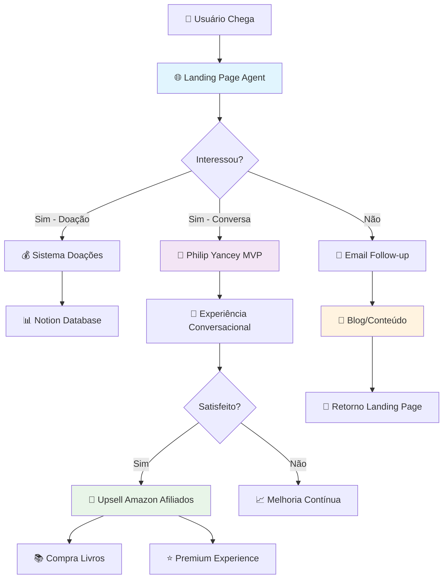
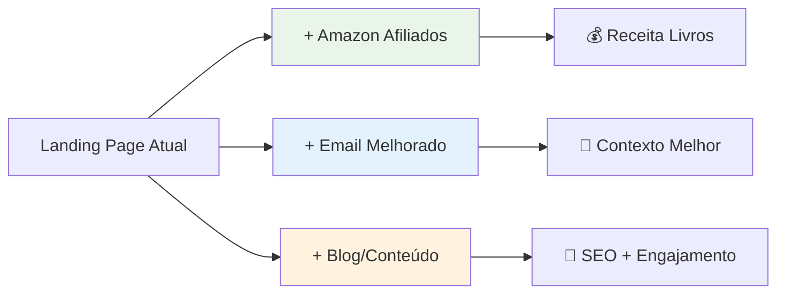
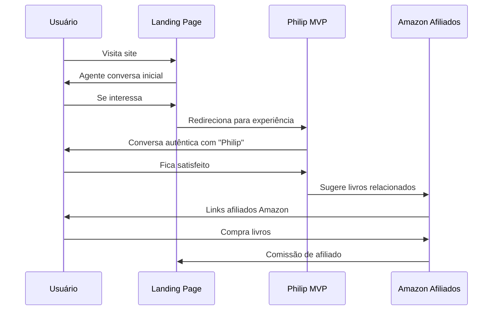
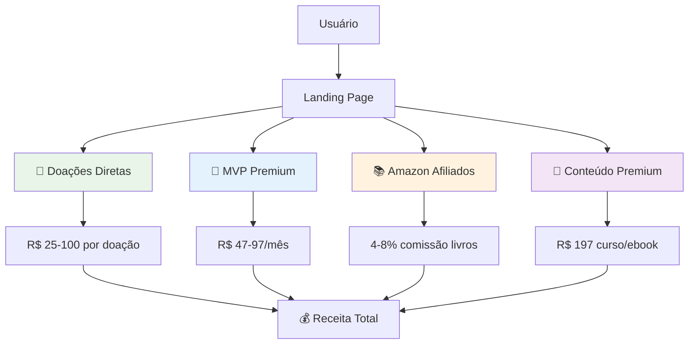
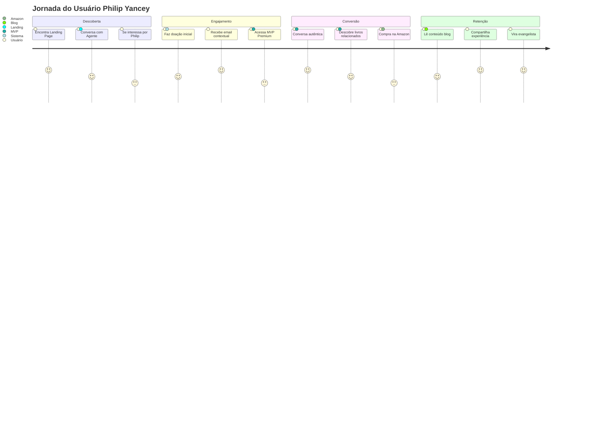
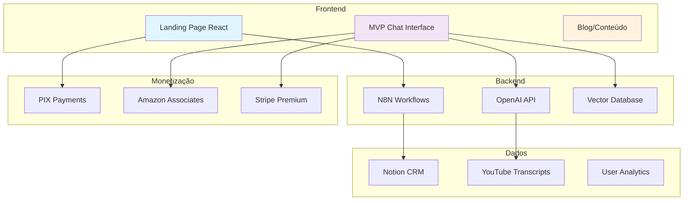

# 🏗️ ARQUITETURA INTEGRADA - ECOSSISTEMA PHILIP YANCEY

## 📊 DIAGRAMA GERAL DO SISTEMA

---

## 🚀 PROJETO 1: LANDING PAGE (Funcionando)

### **Stack Atual**
- ✅ React + N8N + Notion + PIX + Gmail
- ✅ Sistema de doações enterprise
- ✅ Agente com tom humano satisfatório

### **Melhorias Planejadas**

---

## 🤖 PROJETO 2: PHILIP YANCEY MVP (Em Desenvolvimento)

### **Stack Proposto**
- React + OpenAI + Vector Database
- YouTube Mining + Whisper AI
- Padrões linguísticos autênticos

### **Integração com Landing Page**

---

## 💰 ESTRATÉGIA DE MONETIZAÇÃO INTEGRADA

### **Fluxo de Receitas**

### **Projeção Financeira**
| Fonte | Ticket Médio | Volume/Mês | Receita/Mês |
|-------|--------------|------------|--------------|
| Doações | R$ 50 | 100 | R$ 5.000 |
| MVP Premium | R$ 67 | 50 | R$ 3.350 |
| Amazon Afiliados | R$ 15 comissão | 200 livros | R$ 3.000 |
| Conteúdo Premium | R$ 197 | 25 | R$ 4.925 |
| **TOTAL** | | | **R$ 16.275** |

---

## 🔄 FLUXO DE USUÁRIO DETALHADO

### **Jornada Completa**

---

## 🛠️ IMPLEMENTAÇÃO TÉCNICA

### **Integração de Sistemas**

---

## 📈 ROADMAP DE INTEGRAÇÃO

### **Fase 1: Conexão Básica (1 semana)**
- [ ] Link da Landing Page para MVP
- [ ] Context sharing entre agentes
- [ ] Amazon Associates setup

### **Fase 2: Experiência Unificada (2 semanas)**
- [ ] Single Sign-On entre sistemas
- [ ] Email sequences melhoradas
- [ ] Recomendações inteligentes de livros

### **Fase 3: Conteúdo Premium (3 semanas)**
- [ ] Blog integrado com Notion CMS
- [ ] Content marketing automation
- [ ] SEO otimizado para "Philip Yancey"

### **Fase 4: Analytics & Otimização (4 semanas)**
- [ ] Tracking completo da jornada
- [ ] A/B testing sistemático
- [ ] Otimização de conversão

---

## 🎯 PRÓXIMAS AÇÕES IMEDIATAS

### **Para Você (David)**
1. **Amazon Associates**: Cadastro + setup links afiliados
2. **Email Templates**: Melhorar contexto e follow-up
3. **Conteúdo Blog**: Definir temas e frequência
4. **YouTube Videos**: Identificar para extração linguística

### **Para Desenvolvimento**
1. **Conectores**: Landing Page → MVP
2. **Analytics**: Tracking de conversão
3. **UI/UX**: Experiência fluida entre sistemas
4. **Performance**: Otimização de velocidade

---

*Atualizado: Maio 31, 2025*
*Arquiteto: David De Cunto + Claude*