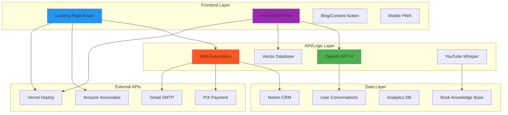
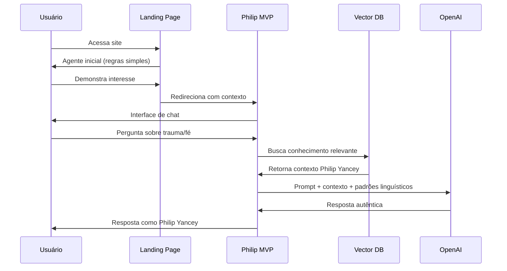
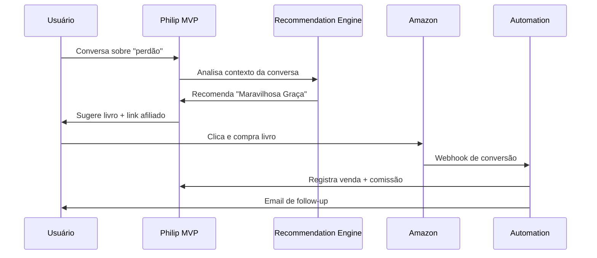
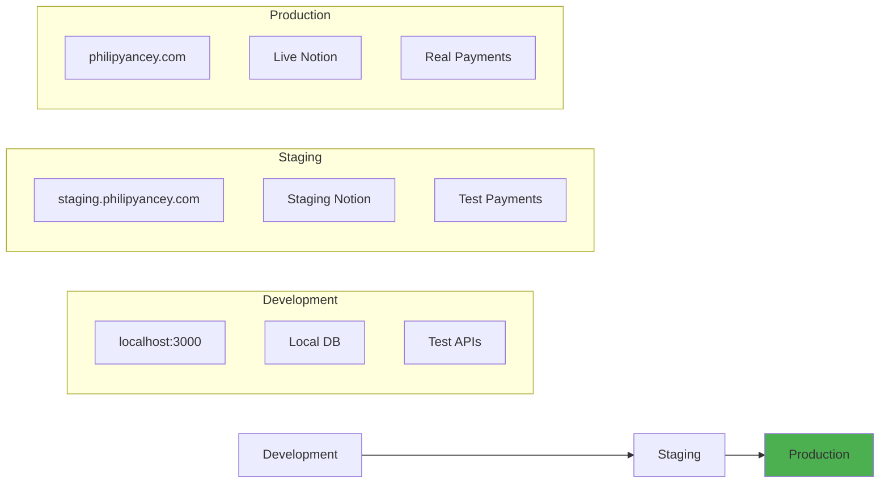

# ⚙️ IMPLEMENTAÇÃO TÉCNICA - PROJETO INTEGRADO

## 🏗️ ARQUITETURA TÉCNICA DETALHADA

### **Stack Completo**


---

## 🔄 FLUXOS DE DADOS CRÍTICOS

### **1. Fluxo de Conversação**


### **2. Fluxo de Monetização**


---

## 💾 ESTRUTURA DE DADOS

### **Schema do Knowledge Base**
```javascript
// Vector Database Schema
const PhilipYanceyKnowledge = {
  books: {
    id: "uuid",
    title: "string",
    chapter: "string", 
    content: "text",
    themes: ["array"],
    stories: ["array"],
    vector_embedding: "float[]"
  },
  
  linguistic_patterns: {
    mannerisms: ["Sabe...", "Bem...", "Deixe-me..."],
    transitions: ["E então...", "Mas aqui está..."],
    vulnerability: ["Eu mesmo...", "Confesso que..."],
    questions: ["E se...", "Você já pensou..."]
  },
  
  conversation_context: {
    user_id: "uuid",
    session_id: "uuid", 
    messages: [{
      role: "user|assistant",
      content: "string",
      timestamp: "datetime",
      emotion_detected: "string",
      books_recommended: ["array"]
    }]
  }
}
```

### **Notion CRM Schema**
```javascript
// Notion Database Structure
const NotionCRM = {
  users: {
    name: "title",
    email: "email",
    whatsapp: "phone_number",
    first_contact: "date",
    total_donations: "number",
    conversation_topics: "multi_select",
    books_purchased: "relation",
    last_interaction: "date",
    user_type: "select" // ["donor", "mvp_user", "premium"]
  },
  
  conversations: {
    user: "relation",
    session_date: "date",
    duration_minutes: "number", 
    topics_discussed: "multi_select",
    books_recommended: "multi_select",
    satisfaction_score: "number",
    conversion_achieved: "checkbox"
  }
}
```

---

## 🚀 DEPLOYMENT & DevOps

### **Ambientes**


### **CI/CD Pipeline**
```yaml
# .github/workflows/deploy.yml
name: Deploy Philip Yancey MVP
on:
  push:
    branches: [main]

jobs:
  deploy:
    runs-on: ubuntu-latest
    steps:
      - uses: actions/checkout@v2
      
      - name: Setup Node.js
        uses: actions/setup-node@v2
        with:
          node-version: '18'
          
      - name: Install dependencies
        run: npm ci
        
      - name: Build project
        run: npm run build
        
      - name: Deploy to Vercel
        uses: vercel/action@v1
        with:
          vercel-token: ${{ secrets.VERCEL_TOKEN }}
          vercel-project-id: ${{ secrets.PROJECT_ID }}
```

---

## 📊 MONITORING & ANALYTICS

### **Métricas Técnicas**
- **Performance**: Tempo de resposta < 2s
- **Uptime**: 99.9% disponibilidade
- **Error Rate**: < 1% de falhas
- **API Calls**: Monitoramento OpenAI usage

### **Métricas de Negócio**
- **Conversão Landing → MVP**: 30%+
- **Engagement MVP**: 15+ min sessão
- **Book Recommendation CTR**: 10%+
- **Amazon Conversion**: 15%+

### **Dashboard Analytics**
```javascript
// Analytics tracking
const trackEvent = (event, properties) => {
  // Google Analytics 4
  gtag('event', event, properties);
  
  // Custom dashboard
  fetch('/api/analytics', {
    method: 'POST',
    body: JSON.stringify({
      event,
      properties,
      user_id: getUserId(),
      timestamp: new Date().toISOString()
    })
  });
};

// Eventos principais
trackEvent('conversation_started', {user_type: 'free'});
trackEvent('book_recommended', {book_title: 'Maravilhosa Graça'});
trackEvent('amazon_click', {book_asin: '8573258692'});
trackEvent('conversion_achieved', {value: 45.90});
```

---

## 🔒 SEGURANÇA & COMPLIANCE

### **Autenticação & Autorização**
```javascript
// JWT-based auth for premium features
const authMiddleware = (req, res, next) => {
  const token = req.headers.authorization;
  
  if (!token && isPreminumFeature(req.path)) {
    return res.status(401).json({error: 'Premium required'});
  }
  
  // Validate token and continue
  next();
};
```

### **LGPD Compliance**
- **Consent**: Opt-in explícito para emails
- **Data Minimization**: Só coletamos o necessário  
- **Right to Delete**: API para remoção de dados
- **Transparency**: Privacy policy clara

---

## 🛠️ FERRAMENTAS DE DESENVOLVIMENTO

### **Stack de Desenvolvimento**
- **Frontend**: React 18 + Vite + Tailwind CSS
- **Backend**: N8N + Node.js + Express
- **Database**: Supabase (PostgreSQL) + Notion API
- **AI**: OpenAI GPT-4 + Pinecone Vector DB
- **Deploy**: Vercel + Railway
- **Monitoring**: Sentry + Google Analytics

### **Scripts de Automação**
```bash
# Package.json scripts
{
  "scripts": {
    "dev": "vite --port 3001",
    "build": "vite build",
    "deploy": "vercel --prod",
    "sync-notion": "node scripts/sync-notion.js",
    "update-vectors": "node scripts/update-knowledge.js",
    "test-conversations": "node scripts/test-ai.js"
  }
}
```

---

## 🎯 PRÓXIMOS MARCOS TÉCNICOS

### **Semana 1-2: Foundation**
- [ ] Conectar Landing Page → MVP
- [ ] Setup Amazon Associates API
- [ ] Email templates melhorados

### **Semana 3-4: AI Enhancement**  
- [ ] YouTube transcript mining
- [ ] Linguistic pattern extraction
- [ ] Contextual book recommendations

### **Semana 5-6: Optimization**
- [ ] Performance tuning
- [ ] Analytics dashboard
- [ ] A/B testing framework

---

*Arquitetura designed for scale: 1K → 10K → 100K users*